# Weather

Weather is a simple Kotlin Multiplatform application built with Compose Multiplatform that gets
weather information data for a specific city.

## Features

- [X] user can get today's weather data
- [X] user can get weather data for the next 7 days
- [X] user can get the last 14 days weather data

## Design

### android

|                                    Loading                                    |                                    Today                                    |                                    More                                    |
|:-----------------------------------------------------------------------------:|:---------------------------------------------------------------------------:|:--------------------------------------------------------------------------:|
| 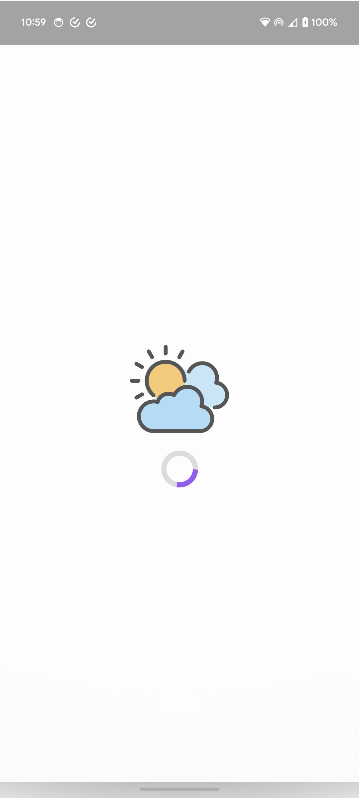 | 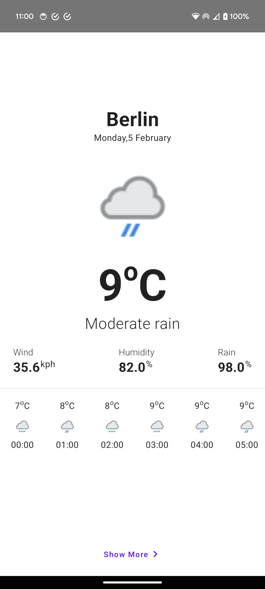 | 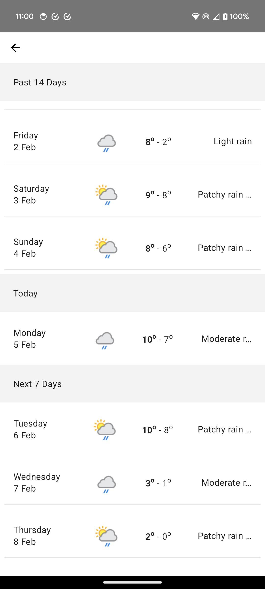 |

### iOS

|                                  Loading                                  |                                  Today                                  |                                  More                                  |
|:-------------------------------------------------------------------------:|:-----------------------------------------------------------------------:|:----------------------------------------------------------------------:|
| 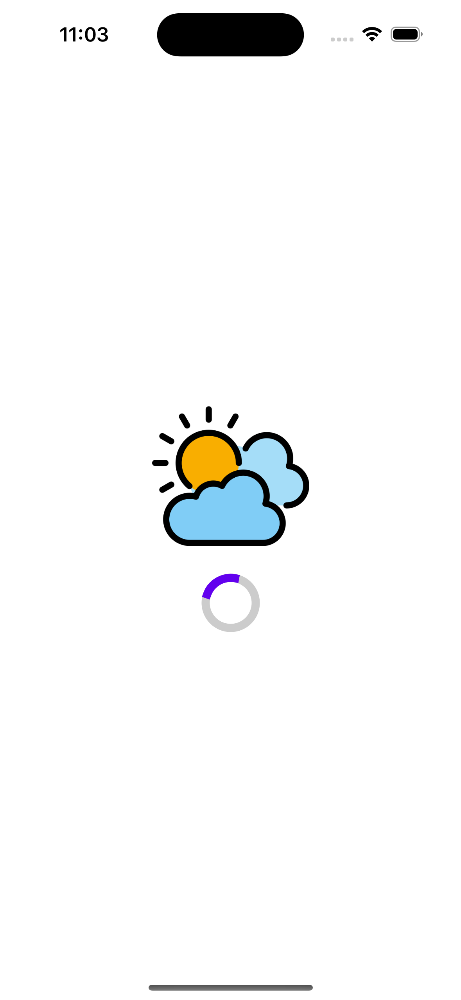 | 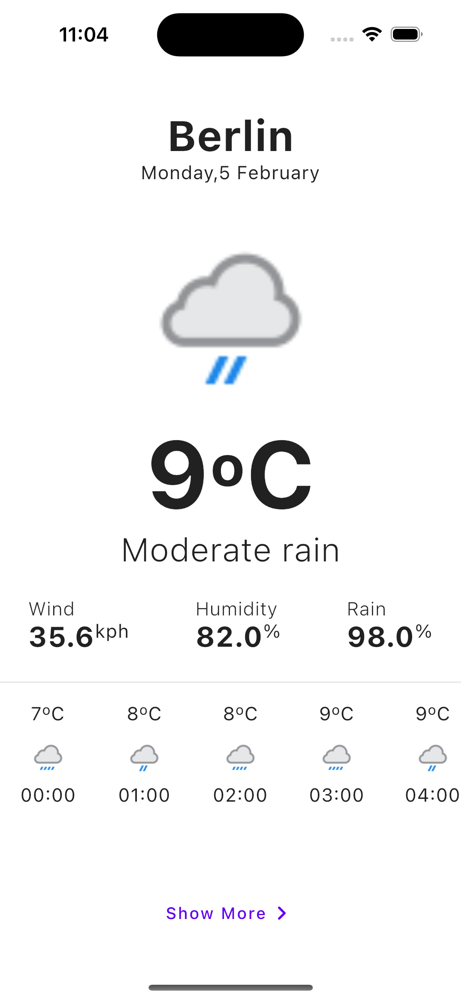 | 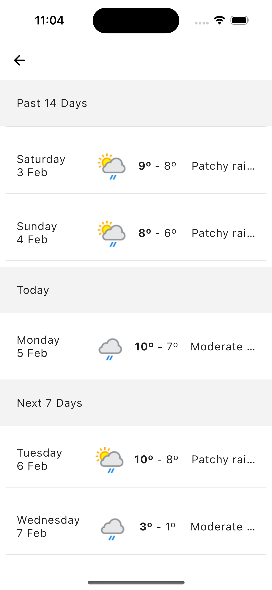 |

## Architecture

This project uses the MVI(Model - View - Intent) architecture based on UDF(Unidirectional Data Flow)
and Reactive programming.

Why?

- more clear and intentional separation of concerns
- single source of truth for our UI state which can only be mutated by intent/actions
- simpler and more direct UI testability, since we can define how the UI should look like with our
  state objects

### Packaging Structure

- `sources`
    - `remotesource`
        - handles getting data from any server/remote source
    - `localsource`
        - handles getting cached device data
- `data`
    - handles getting and mutating data from needed sources
- `domain`
    - handles encasing business logic for reuse
- `ui`
    - handles displaying data on device

### Testing

The app includes both unit and instrumented tests.
#### Sources
---

- Remote

|                             WeatherRemoteSource                              |
|:----------------------------------------------------------------------------:|
| 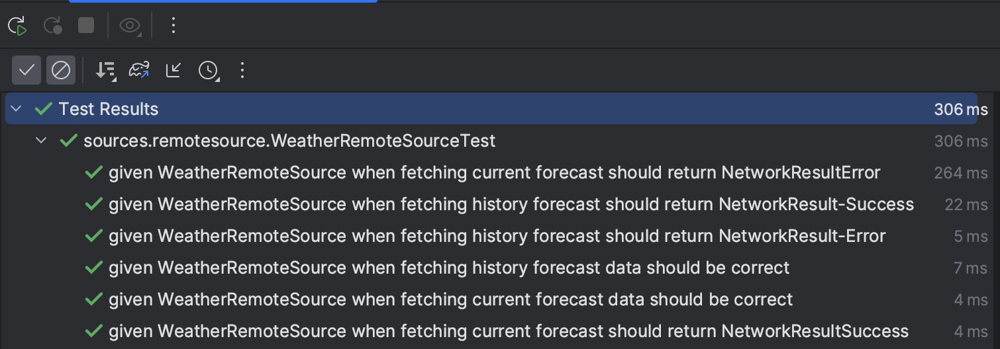 |

- Local

|             WeatherLocalSource              |
|:-------------------------------------------:|
| 
 
In Progress
 
 |

#### Data
---

- Repositories

|                             WeatherRepository                              |
|:--------------------------------------------------------------------------:|
| 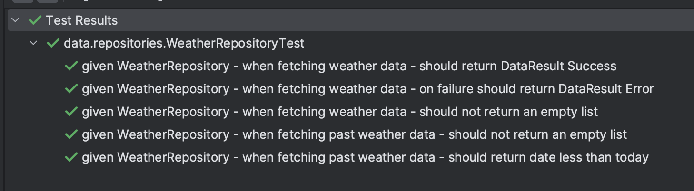 |

- Extensions

|                                         DateTime                                          |
|:-----------------------------------------------------------------------------------------:|
| 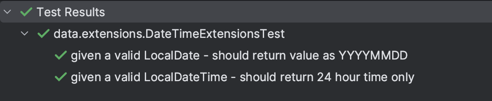 |

|                                         String                                          |
|:---------------------------------------------------------------------------------------:|
| 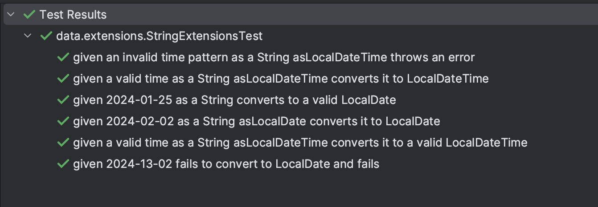 |

|                                         Int                                          |
|:------------------------------------------------------------------------------------:|
| 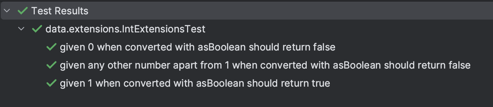 |

#### Domain
---

|                             GetCurrentWeatherDataUseCase                             |
|:------------------------------------------------------------------------------------:|
| 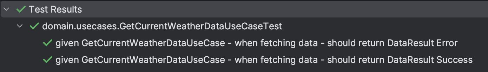 |

|                             GetHistoryWeatherDataUseCase                             |
|:------------------------------------------------------------------------------------:|
| 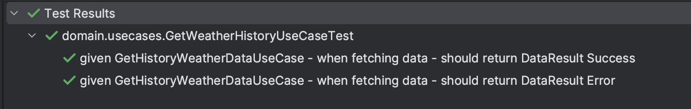 |

#### ui
---

- screen-model

|                                WeatherDetailScreenModel                                 |
|:---------------------------------------------------------------------------------------:|
| 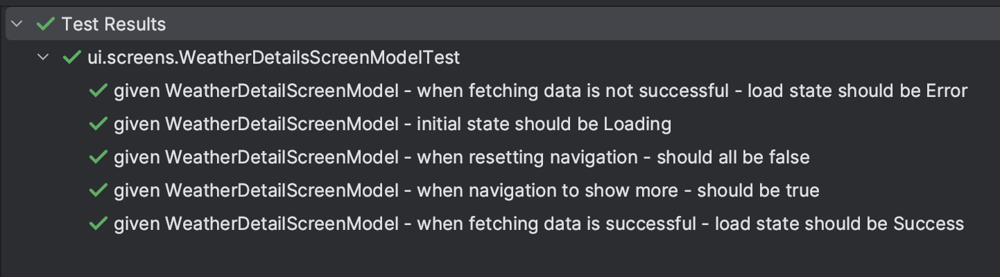 |

|                                WeatherListScreenModel                                |
|:------------------------------------------------------------------------------------:|
| 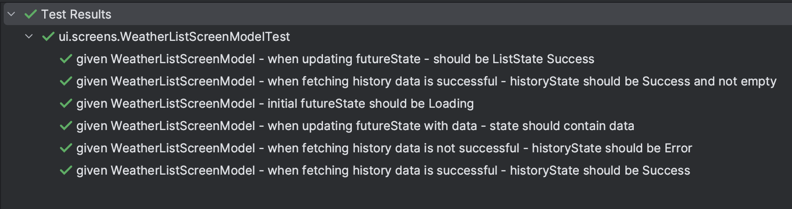 |

- screens

|                                   WeatherDetailScreen                                   |
|:---------------------------------------------------------------------------------------:|
| 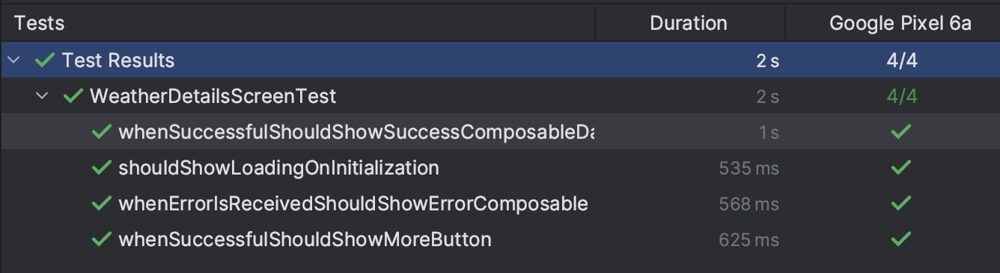 |

|              WeatherListScreen              |
|:-------------------------------------------:|
| 
 
In Progress
 
 |

## Stack

### Language & Framework

| Title                                                                              | Description                        |
  |:-----------------------------------------------------------------------------------|:-----------------------------------|
| [Kotlin](https://kotlinlang.org/)                                                  | `fun` programming language         |
| [KMP - Kotlin Multiplatform](https://www.jetbrains.com/kotlin-multiplatform/)      | cross platform framework           |
| [CMP - Compose Multiplatform](https://www.jetbrains.com/lp/compose-multiplatform/) | declarative UI rendering framework |
| [Ktor](https://github.com/ktorio/ktor)                                             | networking client framework        |

### Libraries

| Title                                                                    | Description          |
|:-------------------------------------------------------------------------|:---------------------|
| [Kotlinx-DateTime](https://github.com/Kotlin/kotlinx-datetime)           | date/time library    |
| [Kotlinx-Coroutines](https://github.com/Kotlin/kotlinx.coroutines)       | async programming    |
| [Kotlinx-Serialization](https://github.com/Kotlin/kotlinx.serialization) | serialization        |
| [Kamel](https://github.com/Kamel-Media/Kamel)                            | image loading        |
| [Voyager](https://github.com/adrielcafe/voyager)                         | navigation           |
| [Koin](https://github.com/InsertKoinIO/koin)                             | dependency injection |

## Improvements
### Layered
- [ ] Sources
  - [ ] add a local cache for the weather forecast
- [ ] Data
  - [ ] get the current day's weather forecast as a flow
  - [ ] handle getting data from the remote source and caching it on device
- [ ] UI
  - [ ] fix the UX on the dates list screen
### General
- [ ] add Air Quality to the details(IMPORTANT!!!)
- [ ] add setup screen for selecting, country, unit of measurement & language
- [ ] add check to show if country has snow or not
- [ ] add ability change selected data
- [ ] add ability to change time from 24hour to 12 hour